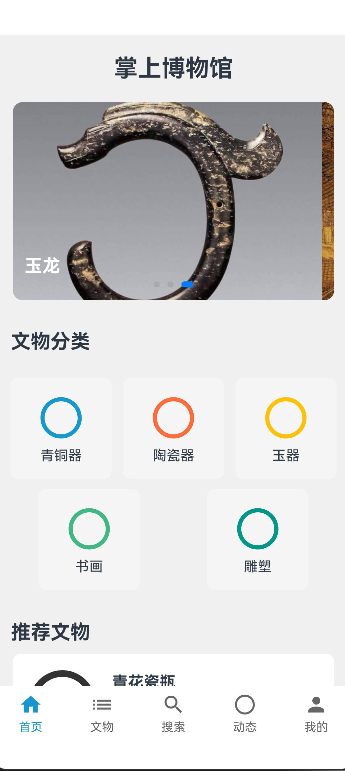
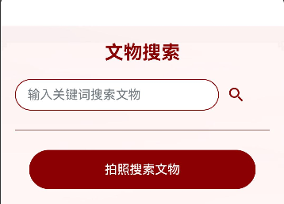
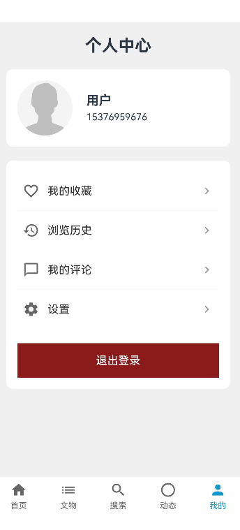
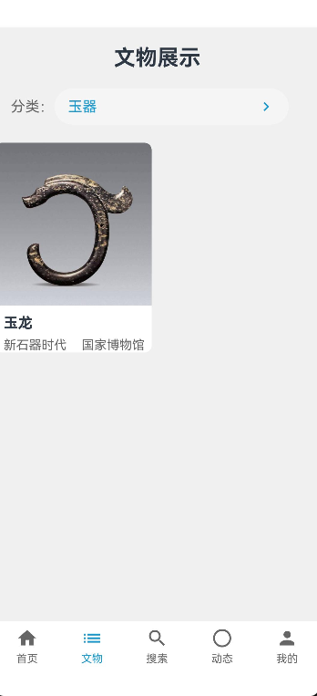
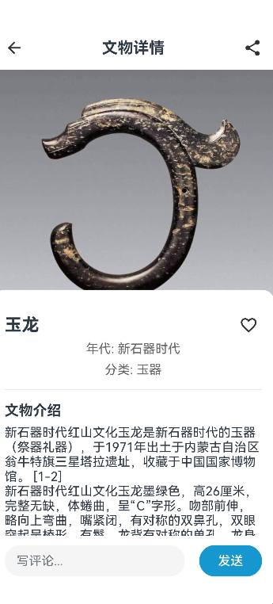
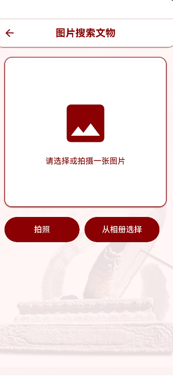
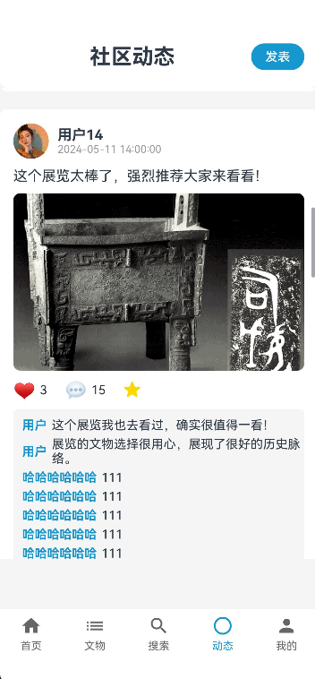
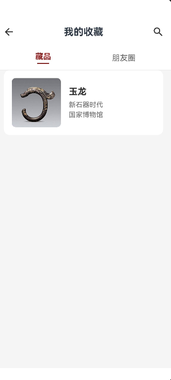
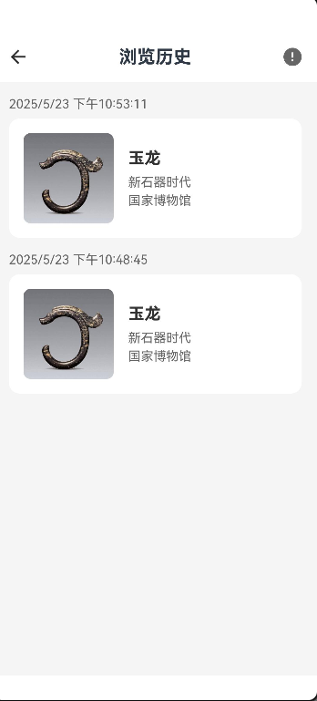

# 用户使用手册
## 海外文物知识服务子系统

### ***\*一、系统简介\****

博物馆文物展示系统是一个专业的在线文物展示平台，为用户提供丰富的文物浏览、搜索、收藏和评论功能。本系统采用现代化的Web技术，界面简洁美观，操作便捷直观。

###***\*二、用户账号管理\****

####***\*1. 注册账号\****

用户首次使用系统需要注册账号。点击首页右上角的"注册"按钮，填写用户名、邮箱和密码。系统会向您的邮箱发送验证码，输入验证码完成注册。注册成功后即可使用系统所有功能。

####***\*2. 登录系统\****

系统支持两种登录方式：账号密码登录和邮箱登录。在登录页面选择登录方式，输入相应信息即可登录。登录后可以享受收藏、评论等个性化功能。

####***\*3. 密码找回\****

如果忘记密码，可以在登录页面点击"忘记密码"，输入注册邮箱获取验证码，验证成功后即可设置新密码。系统会通过邮件发送验证码，确保账号安全。

###***\*三、文物浏览与搜索\****

####***\*1. 首页浏览\****

系统首页展示精选文物，采用分页方式展示，每页显示8件文物。用户可以通过点击文物图片查看详细信息，包括高清图片、基本信息、详细描述等。

####***\*2. 高级搜索\****

系统提供强大的搜索功能，支持多维度筛选：

· 按文物类型筛选（如瓷器、书画等）

· 按朝代筛选（如汉代、唐代等）

· 按博物馆筛选

· 按艺术家筛选

· 支持关键词搜索

· 支持按名称、年代等条件排序

####***\*3. 文物详情\****

点击文物图片进入详情页面，可以查看：

· 文物高清图片

· 基本信息（名称、朝代、类别等）

· 详细描述

· 相关文物推荐

· 其他用户评论

###***\*四、个性化功能\****

####***\*1. 收藏功能\****

在文物详情页面，点击"收藏"按钮可以将文物添加到收藏夹。在个人中心的"我的收藏"中可以：

· 查看所有收藏的文物

· 按文物名称搜索

· 按收藏时间筛选

· 取消收藏

####***\*2. 评论功能\****

在文物详情页面底部可以发表评论，与其他用户交流讨论。用户可以：

· 发表评论

· 查看所有评论

· 删除自己的评论

· 按时间查看评论

####***\*3. 浏览历史\****

系统自动记录用户的浏览历史，在个人中心的"浏览历史"中可以：

· 查看最近浏览的文物

· 按文物名称搜索

· 按浏览时间筛选

· 删除浏览记录

###***\*五、个人中心\****

1. 个人信息管理

在个人中心可以：

· 修改头像

· 更新个人资料

· 修改密码

· 更新邮箱

2. 数据管理

系统提供完整的数据管理功能：

· 收藏管理

· 评论管理

· 浏览历史管理

###***\*六、使用技巧\****

####***\*1. 快速搜索\****

· 使用文物名称关键词

· 使用朝代名称

· 使用艺术家名称

· 组合多个条件进行精确搜索

####***\*2. 收藏管理\****

· 定期整理收藏列表

· 使用筛选功能快速找到特定文物

· 关注感兴趣的文物类型

####***\*3. 评论互动\****

· 发表有意义的评论

· 与其他用户交流讨论

· 分享文物知识

###***\*七、注意事项\****

####***\*1. 账号安全\****

· 定期修改密码

· 不要将账号信息告诉他人

· 及时更新邮箱信息

· 使用安全的网络环境

####***\*2. 内容规范\****

· 评论内容要文明礼貌

· 遵守相关法律法规

· 尊重文物历史价值

· 不发布虚假信息

####***\*3. 系统使用\****

· 保持网络连接稳定

· 定期清理浏览器缓存

· 使用最新版本的浏览器

· 及时更新系统

###***\*八、常见问题\****

####***\*1. 登录问题\****

如果遇到登录问题，可以：

· 检查账号密码是否正确

· 使用"忘记密码"功能重置密码

· 确认邮箱验证是否完成

· 联系客服获取帮助

####***\*2. 功能问题\****

***\*如果遇到功能问题，可以：\****

· 检查网络连接

· 刷新页面

· 清除浏览器缓存

· 联系技术支持

#### ***\*3. 其他问题\****

***\*如果遇到其他问题，可以：\****

· 查看帮助文档

· 发送问题反馈

· 等待系统更新


## 知识问答子系统

### 系统概述

本知识问答子系统是“海外藏中国文物知识管理平台”中的一个核心模块，旨在为用户提供基于知识图谱的智能问答服务。用户可以通过自然语言提问，系统将根据 Neo4j 知识图谱，结合历史对话上下文，返回准确、丰富的答案。

### 功能介绍

本系统主要包含以下核心功能：
用户提问与回答：用户在聊天界面输入问题，系统将自动解析问题并返回基于知识图谱的答案。


多轮对话支持：系统能够理解并衔接多轮对话上下文，保证连续性与完整性。

历史记录管理：支持记录用户的历史提问与回答，用户可以查看和回顾过往聊天记录。

用户身份管理：前端提供用户身份管理功能，支持不同用户的问答历史隔离和管理。

复杂问题处理：支持处理多实体多属性复杂问题，并能基于上下文提供相应的答案。

闲聊：支持简单闲聊


### 使用环境与前提条件

设备：PC 或移动设备
浏览器：推荐使用最新版本的 Chrome、Edge 或 Firefox
网络：保持网络通畅
用户需提前注册登录账号，以便系统记录历史对话和身份信息

### 用户操作流程

#### 登录与身份验证

1️打开系统首页，点击左上角的“设置用户名”按钮。
2️输入用户名进行身份验证。
3️登录成功后，进入知识问答界面。

#### 提出问题

在聊天输入框中输入你的问题（如“双龙鼻烟壶的材质是什么？”）。
点击“发送”按钮，系统将快速返回答案。

#### 查看回答

系统会在聊天窗口中自动回复你的问题答案。如果答案存储于项目数据库，答案将基于 Neo4j 知识图谱数据进行回答，具有丰富的文物背景和专业性；如果不存在，答案将基于大模型基础知识回答。

#### 多轮问答支持

你可以继续提问补充问题，系统会自动结合历史上下文，提供连贯的回答。

#### 历史记录查看

在用户中心或聊天界面中，可以查看和管理你的历史聊天记录。

### 技术支持与常见问题

Q1：遇到无法回答的问题怎么办？
系统会提示“知识图谱中未找到相关答案”并给出给出基于大模型基础知识库的答案。
Q2：我的聊天记录会丢失吗？
不会。系统自动保存历史记录，可随时查看。
Q3：系统崩溃或异常怎么办？
请刷新浏览器页面，或联系管理员进行技术支持。

### 注意事项

请勿在系统中输入恶意、违法或敏感内容。
不要重复提交相同问题，避免对服务器造成负载压力。

## 掌上博物馆子系统

**掌上博物馆 HarmonyOS 应用**  
*版本 1.0.0*

</div>

### 目录

- 用户使用手册
  - 海外文物知识服务子系统
    - ***\*一、系统简介\****
      - ***\*3. 其他问题\****
  - 知识问答子系统
    - 系统概述
    - 功能介绍
    - 使用环境与前提条件
    - 用户操作流程
      - 登录与身份验证
      - 提出问题
      - 查看回答
      - 多轮问答支持
      - 历史记录查看
    - 技术支持与常见问题
    - 注意事项
  - 掌上博物馆子系统
- 掌上博物馆应用用户使用手册
  - 目录
  - 1. 应用介绍
  - 2. 安装与设置
    - 2.1 系统要求
    - 2.2 应用下载与安装
    - 2.3 初次设置
  - 3. 界面导航
    - 3.1 底部导航栏
    - 3.2 顶部搜索栏
    - 3.3 侧滑菜单
  - 4. 账号管理
    - 4.1 注册账号
    - 4.2 登录账号
    - 4.3 个人信息管理
    - 4.4 隐私设置
  - 5. 文物浏览功能
    - 5.1 首页推荐
    - 5.2 文物分类浏览
    - 5.3 文物详情查看
  - 6. 搜索功能
    - 6.1 关键词搜索
    - 6.2 以图搜图
    - 6.3 高级筛选
  - 7. 社区互动功能
    - 7.1 发布动态
    - 7.2 点赞与评论
  - 8. 个人中心
    - 8.1 收藏管理
    - 8.2 浏览历史
    - 8.3 我的动态
    - 8.4 通知消息
  - 9. 常见问题解答
  - 10. 问题反馈与支持

### 1. 应用介绍

掌上博物馆是一款专注于展示海外藏中国文物的HarmonyOS应用。本应用收录了波士顿美术馆、纳尔逊-阿特金斯艺术博物馆和明尼阿波利斯艺术博物馆的珍贵中国文物藏品，通过高清图片、详细介绍、3D模型和音视频讲解等多媒体形式，为用户提供沉浸式的文物浏览体验。

<div align="center">

<p><i>图1-1: 掌上博物馆应用主要功能展示</i></p>
</div>

应用特色功能：

- 文物高清图片浏览与详情查看
- 文物3D模型交互式展示
- 创新的以图搜图功能
- 丰富的社区互动体验
- 个性化的文物收藏管理

### 2. 安装与设置

#### 2.1 系统要求

- HarmonyOS 2.0 及以上版本
- 内存：至少2GB RAM
- 存储空间：至少200MB可用空间
- 网络连接：Wi-Fi或移动数据网络

#### 2.2 应用下载与安装

**通过华为AppGallery下载安装**

1. 在设备上打开华为AppGallery（华为应用市场）
2. 在搜索栏中输入"掌上博物馆"
3. 点击应用图标，进入应用详情页
4. 点击"安装"按钮，等待安装完成

#### 2.3 初次设置

首次启动应用后，将引导您完成以下设置：

1. **权限授予**：应用会请求相机权限（用于以图搜图）和存储权限（用于保存图片）。您可以根据需要选择是否授予。
2. **用户登录/注册**：您可以选择注册新账号、使用华为账号登录，或者跳过此步骤以游客模式使用应用。
3. **个性化设置**：选择您感兴趣的文物类别，应用将根据您的喜好推荐内容。
4. **数据使用设置**：选择是否允许在移动数据网络下自动下载图片和视频内容。

<div align="center">

<p><i>图2-4: 应用首次启动设置引导页面</i></p>
</div>

### 3. 界面导航

#### 3.1 底部导航栏

应用主界面底部导航栏包含五个主要功能入口：

- **首页**：浏览推荐文物和热门博物馆
- **分类**：按类别、年代、博物馆等多维度浏览文物
- **搜索**：使用关键词或图片搜索文物
- **社区**：浏览和发布用户动态，参与互动
- **我的**：查看个人收藏、浏览历史和设置

<div align="center">

<p><i>图3-1: 应用底部导航栏功能示意图</i></p>
</div>

#### 3.2 顶部搜索栏

在首页和分类页顶部，您可以找到搜索栏：

- 点击搜索图标进入搜索页面
- 点击相机图标启动以图搜图功能
- 搜索栏下方会显示热门搜索词和您的搜索历史

<div align="center">

<p><i>图3-2: 应用顶部搜索栏功能展示</i></p>
</div>

#### 3.3 侧滑菜单

从屏幕左侧边缘向右滑动，可打开侧滑菜单，包含以下选项：

- **账号信息**：显示用户头像、昵称和等级
- **通知中心**：查看系统通知和互动消息
- **离线收藏**：访问已下载的离线文物内容
- **设置**：调整应用设置和偏好
- **帮助与反馈**：获取使用帮助和提交反馈
- **关于我们**：查看应用版本和相关信息

### 4. 账号管理

#### 4.1 注册账号

您可以通过以下步骤注册新账号：

1. 打开应用，点击底部导航栏的"我的"
2. 如未登录，点击"立即登录/注册"
3. 在登录页面，点击底部的"注册新账号"
4. 选择使用手机号或电子邮箱注册
5. 按照提示填写信息并验证
6. 设置密码，完成注册

<div align="center">

<p><i>图4-1: 账号注册流程界面</i></p>
</div>

#### 4.2 登录账号

您可以通过以下方式登录账号：

1. **账号密码登录**：使用注册的手机号/邮箱和密码登录
2. **验证码登录**：使用手机号接收验证码后登录
3. **华为账号登录**：点击"华为账号登录"，授权后直接登录
4. **指纹/面部识别登录**：首次登录后，可在设置中开启生物识别登录

<div align="center">

<p><i>图4-2: 多种账号登录方式界面</i></p>
</div>

#### 4.3 个人信息管理

登录后，您可以在"我的"页面管理个人信息：

1. 点击头像或昵称进入个人资料页
2. 在个人资料页，您可以：
   - 修改头像（点击头像更换）
   - 编辑昵称、个人简介
   - 设置个人标签（兴趣爱好）
   - 绑定/更换手机号或邮箱
   - 修改密码

<div align="center">

<p><i>图4-3: 个人信息管理界面</i></p>
</div>

#### 4.4 隐私设置

保护您的隐私安全，您可以调整以下设置：

1. 在"我的"页面，点击"设置"
2. 进入"隐私设置"
3. 您可以管理：
   - 谁可以看到我的动态（所有人/仅关注者/仅自己）
   - 是否允许被他人关注
   - 是否公开收藏列表
   - 是否参与推荐系统

### 5. 文物浏览功能

#### 5.1 首页推荐

首页为您提供精选文物和博物馆内容：

1. **今日推荐**：每日更新的精选文物，左右滑动可查看更多
2. **热门博物馆**：展示热门博物馆及其代表性藏品
3. **最新上线**：最新加入数据库的文物展示
4. **猜你喜欢**：基于您的浏览历史和收藏推荐的文物
5. **主题专区**：根据不同主题（如青铜器、瓷器等）组织的专题内容

<div align="center">

<p><i>图5-1: 首页文物推荐内容展示</i></p>
</div>

下拉页面可刷新内容，上拉加载更多推荐。

#### 5.2 文物分类浏览

在分类页面，您可以通过多种方式浏览文物：

1. **类别分类**：按文物类型分类（如陶瓷、书法、绘画等）
2. **年代分类**：按历史朝代分类（如汉代、唐代、宋代等）
3. **博物馆分类**：按收藏博物馆分类
4. **材质分类**：按文物材质分类（如青铜、瓷器、玉石等）

<div align="center">

<p><i>图5-2: 文物分类浏览界面</i></p>
</div>

点击任一分类，进入对应的文物列表页。在列表页中：

- 可切换网格视图和列表视图
- 可使用筛选功能进一步精确查找
- 支持按热度、时间、名称等排序

#### 5.3 文物详情查看

点击任一文物缩略图，进入文物详情页：

1. **基本信息**：文物名称、年代、出土地、收藏博物馆等
2. **详细描述**：文物的历史背景、艺术特色、文化价值等
3. **高清图片**：多角度的高清图片，支持放大查看细节
4. **相关文物**：与当前文物相关的其他藏品推荐
5. **用户评论**：查看其他用户的评论和讨论

<div align="center">

<p><i>图5-3: 文物详情页界面</i></p>
</div>

在详情页顶部，您可以：

- 点击收藏按钮将文物加入收藏
- 点击分享按钮分享文物到社交媒体或社区
- 点击下载按钮保存文物信息到本地（支持离线查看）

### 6. 搜索功能

#### 6.1 关键词搜索

您可以通过关键词快速找到感兴趣的文物：

1. 点击底部导航栏的"搜索"或顶部搜索框
2. 输入关键词（如"青花瓷"、"唐三彩"等）
3. 可使用搜索筛选条件：
   - 类别筛选
   - 年代筛选
   - 博物馆筛选
   - 材质筛选

4. 搜索结果支持多种排序方式：
   - 相关度排序
   - 热度排序
   - 时间排序（按年代早晚）

#### 6.2 以图搜图

创新的以图搜图功能让您通过图片寻找相似文物：

1. 在搜索页面，点击相机图标
2. 选择图片来源：
   - 拍摄新照片
   - 从相册选择
   - 截取屏幕内容

<div align="center">

<p><i>图6-3: 以图搜图图片来源选择</i></p>
</div>

3. 调整裁剪框，选择要搜索的部分
4. 点击"搜索"按钮开始识别
5. 查看相似度排序的搜索结果

**最佳实践**：

- 确保光线充足，图像清晰
- 尽量减少背景干扰
- 选择文物上的特征部分进行搜索

#### 6.3 高级筛选

搜索结果页面提供高级筛选功能：

1. 点击搜索结果页面顶部的"筛选"按钮
2. 在弹出的筛选面板中，您可以设置：
   - 文物类别（可多选）
   - 年代范围（可拖动时间轴选择）
   - 博物馆（可多选）
   - 材质（可多选）
   - 文物状态（完整/残缺）

3. 点击"应用"按钮查看筛选后的结果
4. 点击"重置"可清除所有筛选条件

### 7. 社区互动功能

#### 7.1 发布动态

您可以在社区分享您的见解和发现：

1. 进入"社区"页面，点击底部的"+"按钮
2. 选择动态类型：
   - 文字动态
   - 图文动态
   - 文物分享（可关联应用内文物）

<div align="center">

<p><i>图7-1: 动态类型选择界面</i></p>
</div>

3. 编辑动态内容：
   - 输入文字描述
   - 添加图片（最多9张）
   - 关联文物（从收藏或浏览历史中选择）
   - 添加话题标签
   - 设置位置信息

4. 设置动态可见范围（所有人/仅关注者/仅自己）
5. 点击"发布"按钮完成发布

#### 7.2 点赞与评论

与其他用户互动，分享您的想法：

1. **点赞**：点击动态或评论下方的心形图标
2. **评论**：
   - 点击动态下方的评论图标
   - 在评论框输入内容
   - 可以@其他用户
   - 可以添加表情

<div align="center">

<p><i>图7-3: 点赞与评论功能界面</i></p>
</div>

3. **回复评论**：点击特定评论进行针对性回复
4. **分享**：点击分享图标将动态分享至其他平台

### 8. 个人中心

#### 8.1 收藏管理

在个人中心管理您收藏的文物：

1. 进入"我的"页面，点击"我的收藏"
2. 收藏页面分为多个分类标签：
   - 全部收藏
   - 自定义收藏夹
   - 按类别自动分组

<div align="center">

<p><i>图8-1: 收藏管理界面与分类</i></p>
</div>

3. 长按收藏项可进行批量操作：
   - 移动至其他收藏夹
   - 下载离线收藏
   - 分享
   - 删除

4. 点击"+"创建新的自定义收藏夹
5. 点击"编辑"可管理收藏夹（重命名、删除、合并等）

#### 8.2 浏览历史

查看和管理您的浏览记录：

1. 在"我的"页面，点击"浏览历史"
2. 浏览历史按时间顺序排列，可查看：
   - 今天浏览的内容
   - 昨天浏览的内容
   - 更早浏览的内容

<div align="center">

<p><i>图8-3: 浏览历史时间分组展示</i></p>
</div>

3. 点击右上角"筛选"可按类别筛选历史记录
4. 点击"清空"可删除全部历史记录
5. 滑动单个项目可快速收藏或删除

#### 8.3 我的动态

管理您发布的社区内容：

1. 在"我的"页面，点击"我的动态"
2. 查看您发布的所有动态
3. 长按动态可：
   - 编辑动态（仅限发布24小时内）
   - 置顶动态（最多3条）
   - 删除动态

#### 8.4 通知消息

查看系统和用户互动通知：

1. 在"我的"页面，点击"消息通知"
2. 通知分为多个类别：
   - 评论与回复（他人对您内容的评论）
   - 点赞（他人对您内容的点赞）
   - 关注（新的关注者）
   - 系统通知（应用更新、活动等）

3. 点击"全部已读"可将所有通知标记为已读
4. 在设置中可调整通知提醒方式

### 9. 常见问题解答

**Q: 应用占用存储空间太大，如何清理？**
A: 进入"设置-存储管理"，可清理缓存、删除离线下载内容或调整图片缓存上限。

**Q: 以图搜图功能无法识别我的图片，怎么办？**
A: 确保光线充足，图像清晰无反光，尽量对准文物特征部分，避免复杂背景干扰。

**Q: 如何更改界面语言？**
A: 进入"设置-语言设置"，可选择简体中文、繁体中文或英文界面。

**Q: 3D模型加载很慢或无法显示？**
A: 请确保网络连接稳定，或尝试在Wi-Fi环境下使用。也可在设置中降低3D模型质量以提高加载速度。

**Q: 如何同步我在Web端的收藏？**
A: 确保使用相同账号登录，进入"我的-设置-数据同步"，点击"立即同步"。

**Q: 忘记密码怎么办？**
A: 在登录页面点击"忘记密码"，可通过绑定的手机号或邮箱重置密码。

### 10. 问题反馈与支持

如果您在使用过程中遇到问题或有任何建议：

1. 在应用内，进入"我的-设置-帮助与反馈"
2. 选择问题类型并填写详细描述
3. 可附加截图以说明问题
4. 提交后，我们将在3个工作日内回复

其他联系方式：

- 客服邮箱：<lokiyu_buct@163.com>

## 后台管理子系统

### 系统概述

本海外文物后台管理系统是基于Plotly Dash框架开发的综合性管理平台，为海外文物展示平台提供全面的后台管理服务。系统采用类MVC架构模式，通过回调机制实现前后端交互，为文物数字化管理提供专业的解决方案。

#### 核心功能模块

- **用户管理系统**：支持Web端和移动端用户的统一管理，包括用户权限分配、用户组管理等
- **文物信息管理**：实现文物入库、出库、分类管理，支持图片预览和批量操作
- **评论审核系统**：人工审核机制结合智能过滤，支持评论和帖子的审核流程
- **数据可视化看板**：实时展示浏览量、评论量、访问量等关键指标，支持多维度数据分析
- **任务调度中心**：支持定时任务、数据采集和消息推送功能
- **权限安全控制**：基于RBAC模型的多层级权限管理体系

#### 系统特点

- **操作友好**：直观的Web界面设计，支持响应式布局，操作简单易学
- **功能完善**：涵盖文物管理全生命周期，从入库到展示的完整流程管理
- **安全可靠**：完善的权限控制机制，支持操作日志追踪和数据备份
- **扩展性强**：模块化设计，支持功能定制和业务扩展
- **性能优良**：高效的数据处理能力，支持大规模数据管理

#### 技术栈

##### 前端技术

- **Plotly Dash** - 核心Web应用框架，基于React.js和Flask
- **Feffery Antd Components** - 基于Ant Design的UI组件库
- **Feffery Utils Components** - 工具类组件和扩展功能

##### 后端技术

- **Python 3.8+** - 主要开发语言
- **Peewee ORM** - 轻量级数据库操作框架
- **MySQL/SQLite** - 关系型数据库支持
- **Waitress/Gunicorn** - Web服务器部署方案

##### 系统架构

- **类MVC架构模式** - 清晰的代码组织结构
- **回调机制** - 实现前后端高效交互
- **模块化设计** - 便于维护和功能扩展

### 功能介绍

本系统提供完整的后台管理解决方案，涵盖用户管理、内容审核、文物管理等核心业务场景：

#### 后台用户登录

系统实现了安全的身份认证机制和基于角色的权限分离体系。支持管理员账户登录验证，确保只有授权用户才能访问管理界面，有效保障系统安全性。


#### 数据看板

首页提供实时动态的数据可视化看板，集中展示系统运营的关键指标和统计信息。管理员可以直观地监控平台运行状态，快速掌握业务数据变化趋势，为决策提供数据支撑。


#### 用户管理

提供统一的用户管理中心，支持Web端和移动端用户的全生命周期管理。管理员可以进行用户信息的增删改查、权限分配、用户状态管理等操作，实现精细化的用户运营管理。


#### 内容审核管理

建立完善的内容审核体系，支持文物评论和社区帖子的统一审核管理。系统提供多维度筛选条件，支持按审核状态快速定位待处理内容，提升审核效率。结合智能过滤机制，有效维护平台内容质量和社区环境。


#### 文物信息管理

构建专业的文物数字化管理系统，支持文物信息的录入、修改、查询和分类管理。提供直观的图片预览功能和批量操作能力，实现文物从入库到展示的全流程数字化管理，提升文物管理的标准化和效率。


#### 数据库维护

提供完整的数据库运维解决方案，支持一键数据备份和恢复操作。系统内置定期自动备份机制，确保数据安全性和可恢复性。简化数据库维护操作，降低运维成本和技术门槛。


### 使用环境和前提条件

#### 系统要求

- **操作系统**：Windows 10/11 或 Linux (Ubuntu 18.04+)
- **Python版本**：Python 3.8+
- **内存要求**：最小4GB，推荐8GB+
- **存储空间**：至少2GB可用空间

#### 软件依赖

- **数据库**：MySQL 5.7+ 或 SQLite 3.0+
- **Web服务器**：
  - Windows环境：Waitress
  - Linux环境：Gunicorn
- **浏览器**：Chrome 80+、Firefox 75+、Safari 13+

#### 网络要求

- **内网访问**：确保服务器与客户端网络连通
- **外网访问**：需配置防火墙规则，开放8090端口
- **域名解析**：生产环境建议配置域名和SSL证书
### 用户操作流程

#### 首次部署和配置

##### 1. 环境准备

```bash
# 创建Python虚拟环境
conda create -n dashgo python=3.8
conda activate dashgo

# 安装依赖包
# Windows用户
python -m pip install -r requirements_win.txt
# Linux用户
python -m pip install -r requirements_linux.txt
```

##### 2. 数据库配置

编辑 `src/config/dashgo.ini` 文件中的数据库连接信息：

```ini
[SqlDbConf]
RDB_TYPE = mysql
# MySQL配置
HOST = 127.0.0.1
PORT = 3306
USER = your_username
PASSWORD = your_password
DATABASE = your_database
POOL_SIZE = 5

# 或SQLite配置
# RDB_TYPE = sqlite
# SQLITE_DB_PATH = ../app.db
```

##### 3. 初始化数据库

```bash
# 切换到src目录
cd src

# 创建数据库表结构
python -c "from database.sql_db.conn import create_rds_table; create_rds_table()"

# 初始化管理员数据
python -c "from database.sql_db.conn import init_rds_data; init_rds_data()"
```

##### 4. 启动服务

**开发环境（本地调试）：**
```bash
cd src
python app.py
```

**生产环境：**

```bash
cd src
# Windows
waitress-serve --host=0.0.0.0 --port=8090 --url-scheme=http --trusted-proxy=* --trusted-proxy-headers=x-forwarded-for --threads=8 app:server

# Linux
gunicorn -w 4 -b 0.0.0.0:8090 app:server
```

**启动任务调度服务（可选）：**
```bash
cd src
python app_apscheduler.py
```
#### 日常使用操作

##### 1. 系统登录

- 访问系统地址：http://your-server:8090
- 默认管理员账户：admin / admin123
- 首次登录建议修改默认密码

##### 2. 用户管理操作

1. 进入"权限管理" → "用户管理"
2. 点击"新增"按钮创建用户
3. 填写用户基本信息（用户名、密码、邮箱等）
4. 分配用户角色和权限
5. 保存并激活用户账户

##### 3. 文物管理操作

1. 进入"文物管理"模块
2. **新增文物**：
   - 点击"新增文物"按钮
   - 填写文物基本信息（名称、描述、分类等）
   - 上传文物图片和相关资料
   - 设置展示状态和权限
3. **文物查询**：
   - 使用搜索框进行关键词搜索
   - 通过分类筛选器快速定位
   - 查看文物详细信息和图片预览

##### 4. 评论审核操作

1. 进入"评论管理"模块
2. 查看待审核评论列表
3. 点击评论查看详细内容
4. 选择"通过"、"拒绝"或"删除"操作
5. 可添加审核备注说明

##### 5. 数据监控查看

1. 进入"数据看板"模块
2. 查看各类统计图表
3. 设置时间范围筛选数据
4. 导出报表数据进行分析

#### 权限管理配置

##### 1. 角色创建

1. 进入"权限管理" → "角色管理"
2. 点击"新增角色"
3. 设置角色名称和描述
4. 配置角色权限矩阵
5. 保存角色配置

##### 2. 权限分配

- **查看权限**：允许查看相关数据和页面
- **新增权限**：允许创建新的数据记录
- **编辑权限**：允许修改现有数据
- **删除权限**：允许删除数据记录
- **审核权限**：允许进行内容审核操作

### 技术支持与常见问题

#### 常见问题排查

##### 1. 无法启动服务

**问题现象**：运行 `python app.py` 后出现错误
**解决方案**：
- 检查Python版本是否为3.8+
- 确认所有依赖包已正确安装
- 检查数据库连接配置是否正确
- 查看端口8090是否被占用

##### 2. 数据库连接失败

**问题现象**：页面显示数据库连接错误
**解决方案**：
- 验证 `dashgo.ini` 中的数据库配置
- 确认数据库服务正在运行
- 检查网络连接和防火墙设置
- 验证数据库用户权限

##### 3. 外部无法访问

**问题现象**：本地可以访问，外部网络无法访问
**解决方案**：
- 修改 `app.py` 中的 `host` 参数为 `0.0.0.0`
- 开放服务器防火墙8090端口
- 检查网络安全组配置
- 确认服务器公网IP和域名解析

##### 4. 权限错误

**问题现象**：用户无法访问某些功能模块
**解决方案**：
- 检查用户角色配置
- 验证权限元数据设置
- 确认角色权限矩阵配置
- 重新登录刷新权限缓存

##### 5. 文件上传失败

**问题现象**：文物图片或文件上传不成功
**解决方案**：
- 检查上传文件大小限制
- 确认文件格式是否支持
- 验证服务器存储空间
- 检查文件目录权限

#### 性能优化建议

##### 1. 数据库优化

- 定期清理过期日志数据
- 为常用查询字段建立索引
- 使用数据库连接池
- 定期进行数据库维护

##### 2. 系统优化

- 合理设置日志级别
- 定期清理临时文件
- 监控系统资源使用情况
- 配置适当的并发数和线程数

##### 3. 网络优化

- 启用Gzip压缩
- 配置CDN加速静态资源
- 使用缓存机制
- 优化图片压缩和加载

#### 技术支持联系方式

- **开发团队**：Team5海外文物后台管理系统开发组
- **技术负责人**：王海翔（组长）
- **文档维护**：戴岱
- **问题反馈**：通过项目GitHub仓库提交Issue

### 注意事项

#### 安全注意事项

##### 1. 账户安全

- **强密码策略**：管理员密码必须包含大小写字母、数字和特殊字符
- **定期更换密码**：建议每3个月更换一次管理员密码
- **账户锁定机制**：连续登录失败5次后自动锁定账户
- **会话管理**：系统会在30分钟无操作后自动登出

##### 2. 数据安全

- **权限最小化**：为用户分配最小必要权限
- **数据备份**：建议每日进行数据库备份
- **敏感数据保护**：用户密码采用加密存储
- **审计日志**：所有关键操作都有完整的审计记录

##### 3. 网络安全

- **HTTPS部署**：生产环境必须启用HTTPS
- **防火墙配置**：仅开放必要的网络端口
- **访问控制**：建议配置IP白名单限制管理员访问
- **定期更新**：及时更新系统依赖包和安全补丁

#### 操作注意事项

##### 1. 数据操作

- **批量操作**：执行批量删除前务必确认操作范围
- **数据导入**：大量数据导入前建议先备份现有数据
- **关联数据**：删除数据前检查是否存在关联关系
- **数据验证**：重要数据修改后需要进行验证确认

##### 2. 系统维护

- **维护窗口**：系统维护应在业务低峰期进行
- **版本升级**：升级前务必备份数据和配置文件
- **配置修改**：修改系统配置前应备份原始配置
- **服务重启**：重启服务前确认所有用户已保存工作

##### 3. 审核流程

- **审核标准**：建立明确的内容审核标准和流程
- **审核记录**：所有审核操作都要留下详细记录
- **申诉机制**：为用户提供申诉渠道和处理流程
- **审核时效**：确保在规定时间内完成审核工作

#### 故障应急处理

##### 1. 服务中断

- **立即检查**：服务器状态、网络连接、数据库状态
- **重启服务**：按照标准流程重启应用服务
- **回滚机制**：如果是升级导致的问题，立即回滚到前一版本
- **用户通知**：及时通知用户系统维护状态

##### 2. 数据异常

- **停止服务**：发现数据异常立即停止相关服务
- **数据恢复**：使用最近的备份进行数据恢复
- **原因分析**：分析数据异常的根本原因
- **预防措施**：制定预防措施避免类似问题再次发生

##### 3. 安全事件

- **立即隔离**：发现安全威胁立即隔离受影响系统
- **密码重置**：强制重置所有管理员密码
- **日志分析**：详细分析安全事件的攻击路径
- **加固措施**：实施额外的安全加固措施

#### 合规要求

##### 1. 数据保护

- 遵循相关数据保护法规要求
- 建立用户数据处理和存储规范
- 实施数据脱敏和匿名化措施
- 建立数据删除和清理机制

##### 2. 审计要求

- 保存完整的操作审计日志
- 日志保存期限不少于1年
- 支持审计日志的查询和导出
- 建立日志完整性保护机制

##### 3. 业务连续性

- 制定业务连续性计划
- 建立灾难恢复预案
- 定期进行应急演练
- 确保关键业务的高可用性

---

**文档版本**：v1.5  
**最后更新**：2025年6月  
**维护团队**：Team5海外文物后台管理系统开发组